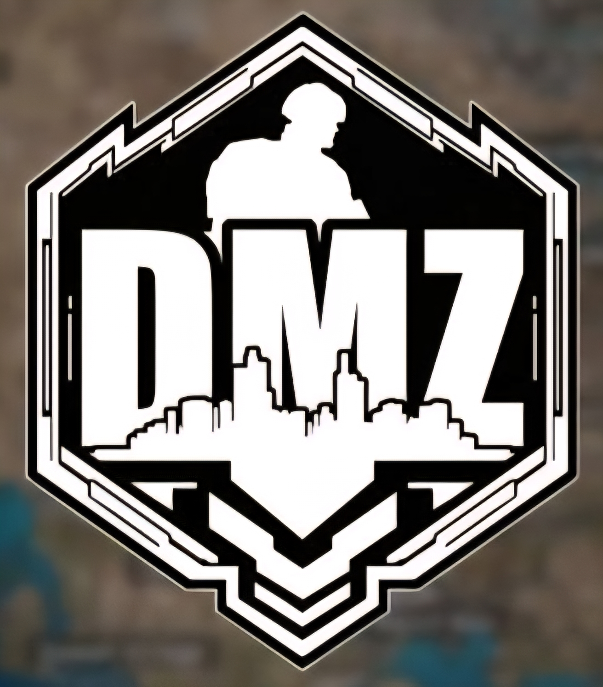
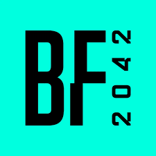
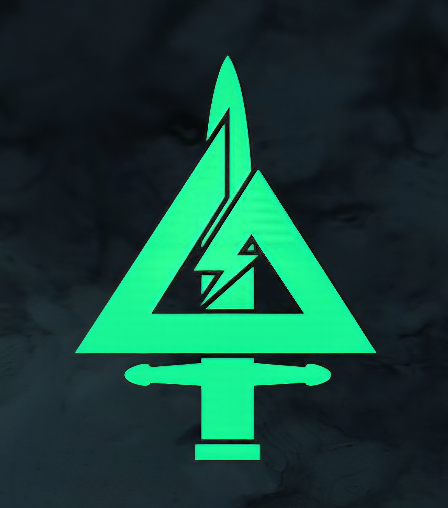

<h3 align="center">Hi, im znand 👋 </h3>

  

---

### Tech Stack & Tools

<strong>Language & Runtime</strong> 

<strong>DevOps & Cloud</strong> 

<strong>Monitoring & Infra</strong> 

<strong>Git & Editor</strong> 

### 🎮 Gaming Setup & Favorites

When I'm not optimizing servers, I'm out fragging enemies.  
COD, BF series, Delta Force — if it's tactical and explodes, I'm in 🎧💥

  
  
  
  

---

### About Me

- Staff IT Engineer @ **PT. Phylot Solusi Integrasi**
- Based in **Palembang, Sumatra Selatan**
- Personal site: [znand.my.id](https://znand.my.id/)
- Currently deep-diving into **Infra-as-Code**, **Telemetry**, and **Exporters**
- 🔭 Always tinkering with **Tunneling**, **Latency Optimizing**, and self-hosted dashboards

---

### 🔗 Connect With Me

  
  
  
  
  

